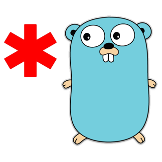

*instinctools Golang knowledge base
=========================

	

This repo is intended to be a platform to share knowledge in Go within *instinctools company. But together we can turn it eventually into something more than local repo. Pull requests and issues are welcome.

Here you can find where to start learning Go, our best practices and advices

- [Our expertise](our-expertise.md) (TDB)
- [Learning Go](learning/README.md)
	- [Must read](learning/must-read.md)
	- [News and knowledge sources](learning/news-and-knowledge-sources.md)
	- [Go distinctive features](learning/go-distinctive-features.md) (TDB)
- [Projects to contribution](projects-to-contribution.md)
- [Why Go and where it can be used?](why-go.md) (TDB)
- [The best known projects](the-best-known-projects.md) (TDB)
- [Books](books.md)
- [Go Community Code of Conduct](code-of-conduct.md)